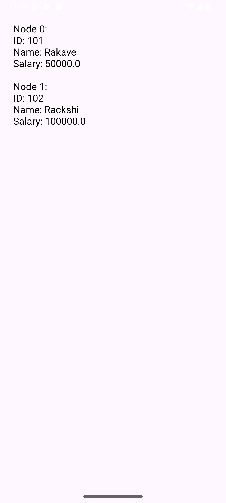

# 📱 Android JSON Parsing App

## 📌 Aim

To create an Android application that extracts employee information from a JSON message and displays it in the user interface.

---

## 🧾 Description

This application demonstrates how to parse JSON data in Android using Java. It supports both:

* **JSONObject parsing** (single employee)
* **JSONArray parsing** (multiple employees)

The extracted data is formatted into a readable string and displayed using a `TextView`.

---

## 🛠️ Tools & Technologies

* Android Studio
* Java
* XML (UI Design)
* JSON (`org.json` library)

---

## 📂 Project Structure

```
JSONParsingApp/
│── app/
│   ├── java/com/example/jsonparsing/
│   │   └── MainActivity.java
│   ├── res/layout/
│   │   └── activity_main.xml
│── AndroidManifest.xml
```

---

## ⚙️ Features

* Parse JSON data from a string
* Extract employee details (ID, Name, Salary)
* Display formatted output in UI
* Error handling using try-catch
* Supports both JSONObject and JSONArray

---

## 🧑‍💻 Code Explanation

### 1. JSON Data

* JSON data is stored as a string inside the app.
* Can represent:

    * Single object → `JSONObject`
    * List of objects → `JSONArray`

---

### 2. Parsing Process

* Convert string → `JSONObject`
* Extract array using key (`Employee`)
* Loop through JSON array
* Retrieve:

    * `id` → Integer
    * `name` → String
    * `salary` → Double

---

### 3. Display Output

* Data is converted into readable format using `StringBuilder`
* Displayed using `TextView`

---

## ▶️ How to Run

1. Open **Android Studio**
2. Create/Open the project
3. Add the provided code
4. Connect an emulator or Android device
5. Click **Run ▶️**
6. View output on screen

---

## 📸 ScreenShot



---

## ⚠️ Error Handling

* Uses `try-catch` block
* Displays error message if JSON parsing fails

---

## 🚀 Future Enhancements

* Fetch JSON data from API
* Display data using RecyclerView
* Add search and filter functionality
* Improve UI design with Material Components

---

## 📚 Conclusion

This project helps understand how to:

* Work with JSON data in Android
* Parse and extract structured information
* Display dynamic content in UI

---


